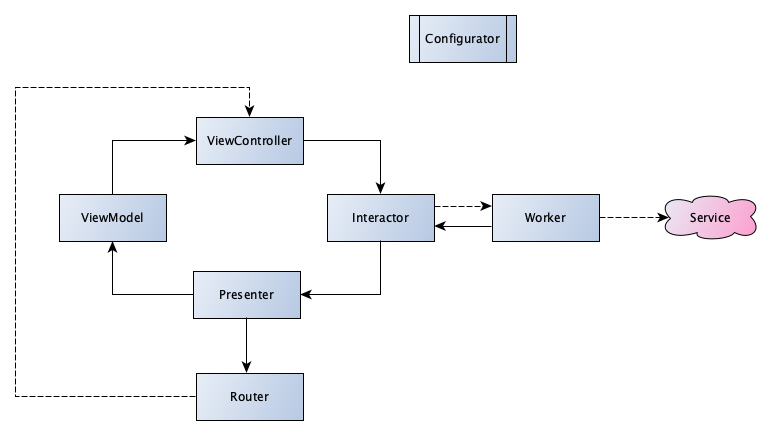

#  one-o-one

The `one-o-one` can be used as an example implementation for the Apple `StoreKit` API. This project was an approach to work with the MNIST dataset to implement a childrens learning-game to teach handwriting of numbers as well as basich arithmetics. The MNIST ML-Model was first generated with the Apple `Create ML` toolkit. Given that the options of Apple's toolkit did not bring the improvement I was looking for, I switched to working with `TensorFlow` to improve the models capabilities. Even though I spent a lot of time into tweeking the parameters it seems the handwriting recognition is not compatible with my own (and other people with whom I tested this) handwriting. Therefore I am making this an open repository in order for other people to use this code as a base for new approaches.

# Architecture

The architectural design of the application is an adaptation of the VIPER-architecture coalesced with the clean-architecture approach. You can find the template for this in [the templates repository](https://github.com/kayoslab/Templates) Each module should consist of a _Worker_, _Interactor_, _Presenter_, _Router_, _ViewController_, _ViewModel_ and _Configurator_. In addition to this each module contains a separate _storyboard_ file. The goal of this architectural approach is to implement the connections between the elements based on contracts. In this way each connection can be mocked and observed and therefore each module can be tested. An added benefit is the strict separation of concerns which is intrinsic by having specific tasks for each element.



Each origin of a connection (arrow) in the above graphic holds an output property, which is a contract (protocol). At the same time the destination of a connection (arrow) conforms to this protocol contract. The dotted line between the _router_ and the _ViewController_ is not architecture specific, but due to the reason that in UIKit the ViewController is the only class that manipulates the view hierarchy by pushing a new ViewController. Therefore, this is just a weak reference. The protocol functions should always be named based on the "knowledge" of the respective elements. In this way a ViewController's output could be `continueButtonPressed`, while for the interactor it might result in `requestNextModule` respectively in the presenter `displayNextModule`. 

In this architecture service classes are usually present as singletons. This is induced by the poor testability of those, since they highly depend on external forces. Furthermore, their lifespan is usually throughout the whole application cycle, which makes it more beneficial from a memory footprint point of view to have a single instance with private initialisers rather than a potential of multiple instances with race conditions.

## ViewController

The ViewController handles any user input, either directly or via one of its subviews. It is important to mention that the ViewController does not decide if an input is going to be processed on its own, but it recognises the control and informs the output over this invocation. Furthermore, a ViewController's purpose is to notify it's subviews that the ViewModel has changed and that they should use said to update layout and content. The ViewController itself should not contain View styling. This is either done in the storyboard or in a specifically created SubView class. In this way the Massive-View-Controller (MVC) problem should be prevented. 

## Interactor

The Interactor implements the ViewController's output and therefore receives it's information. Based on the invocations of user input the interactor might request additional information via the Worker reference. This means the Interactor also implements the Worker's output to be informed on asynchronous worker tasks. The interactor collects the information from ViewController and Worker and decides if the presenter should be notified via the Interactor's output. This makes the Interactor a part of the business logic, which contains the decision tasks. The interactor should not call functions outside the module on it's own, but encourage other elements to do so (either via the presenter or the worker).


## Worker

The Worker class is the single point of contact for communication with external services and data provider. This class should be the only module class which references external dependencies or data sources. In this way a change in data models or service providers has a minimum impact on the actual module and a loose coupeling to business logic can be ensured. The Worker should use it's output contract to inform the Interactor instead of directly returning a value. Therefore the Worker is a data provider and executer, which makes it the second part of the business logic.

## Presenter

The Presenter class receives a message invocation from the Interactor which might contain data or new information. Based on this the Presenter will either update/create the ViewModel and inform the ViewController or notify the Router instead. If necessary, the presenter can hold a permanent reference of the ViewModel object. This should be prevented if possible.

## Router

The Router's interface should only contain destinations that can be reached from within the current module. The Router will not notify the Presenter on successfully showing a new module to the user, but rather just stop from here on. This means that the ViewController might need to implement the `viewWillDisappear` to inform the Interactor over the upcoming navigation.  

## ViewModel

The ViewModel is a _call by value_ object (Struct) that holds all the relevant properties for updating all layouts and views within the module. The ViewModel might come with one or multiple convenience initialisers and can be kept as a mutable reference in the Presenter.

## Configurator

The Configurator class acts as an initialiser for the module. It creates all output references between the items, so that a module will not fail when being created.

# Scripts

## Run script phases

During the build and installation time several script phases are executed. Apart from cocoapods specific validation phases and google specific copy phases there are also some that require in detail knowledge about the environment of the application.

### Templates

To ensure that the project follows a consistent architectural design, templates for the creation of new modules and module-tests are copied during the build phase.
```bash
set -eo pipefail
IFS=$'\n\t'

# Remove all existing files
rm -fR ~/Library/Developer/Xcode/Templates/File\ Templates/VIP\ Template

# Create directory
mkdir -p ~/Library/Developer/Xcode/Templates/File\ Templates/

# Copy all included templates to the templates directory
cp -R ./Templates/VIP\ Template ~/Library/Developer/Xcode/Templates/File\ Templates/

echo "Templates copied"
```
This run script phase will delete an existing (maybe outdated) instance of the template folder from the Xcode templates. Afterwards it will copy the latest templates from the [Templates](./Templates/) folder in the project. 

### Linting

Subsequently to installing the necessary dependencies the linter shall be executed using the project specific [style guidelines](./swiftlint.yml). This will create warnings and errors in case the project style is not following the best practice rules of swift development. As well as several rules I personaly see as best practice. Please mind also the custom rules that were defined in regular expressions as part of the style guidelines. If you do not have swiftlint installed (you should), you can either check the [installation guide](https://github.com/realm/SwiftLint) or remove the build phase since the code already conforms to those rules.
```bash
if [ -x "$(command -v swiftlint)" ]; then
    swiftlint autocorrect --config swiftlint.yml
    swiftlint --config swiftlint.yml
    echo "[✅] swiftlint executed successfully."
else
    echo "[❌] An error occured executing swiftlint."
    exit 1
fi


```

### Code Generation

To make the interaction with Storyboards and Strings easier, the project is using swiftgen for code generation using the project specific [configuration](swiftgen.yml). If you do not have swiftgen installed, you can either check the [installation guide](https://github.com/SwiftGen/SwiftGen) or remove the build phase, since the generated files are already present and linked as .swift files.
```bash
if [ -x "$(command -v swiftgen)" ]; then
    swiftgen config run
    echo "[✅] swiftgen executed successfully."
else
    echo "[❌] An error occured executing swiftgen."
fi

```
